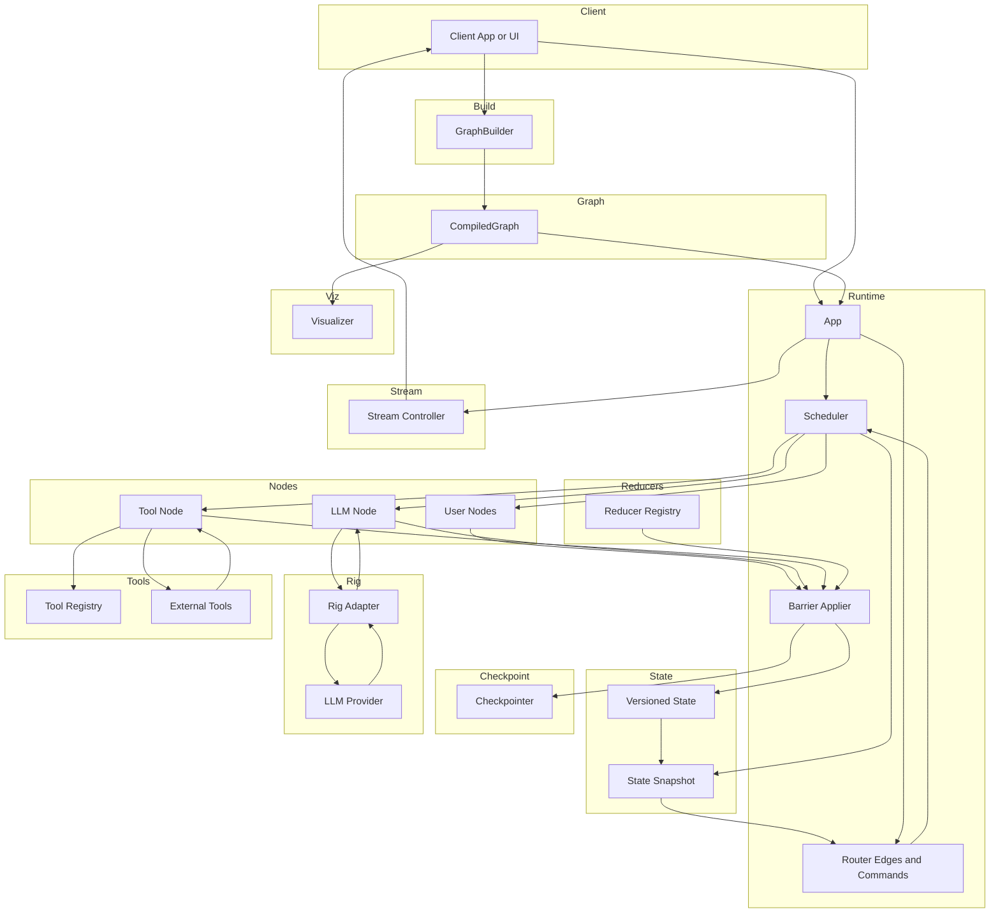

# Graft

A Rust-based framework for building graph-driven, concurrent agent workflows—an alternative to Python’s LangGraph, with a focus on explicit state, deterministic execution, and extensibility.

## Overview

Graft provides a minimal, extensible runtime for orchestrating nodes (agents) over a directed graph, with versioned state channels and deterministic barrier merges. It’s designed for LLM and tool orchestration, but general enough for broader dataflow and actor-style applications.

Dream final state architectural flow chart

## Features

- **Versioned, channelized state** (messages, outputs, meta)
- **Pluggable reducers** for deterministic state merges
- **Parallel node execution** with superstep/barrier model
- **Extensible graph topology** (nodes, edges)
- **Async execution** via Tokio

## Quick Start

...coming

## Documentation

- See [`doc/iteration1_demo1.md`](doc/iteration1_demo1.md) for a detailed architecture overview, roadmap, and design principles.
- The documentation folder contains design notes, glossary, roadmap, and open questions to guide contributors and future development.
- Example code and usage patterns are described in the documentation, but are not runnable as-is.

## Roadmap

- Dynamic channel registry
- Structured error handling
- Logging & tracing
- Graph validation
- Real-world node examples (LLM, tools, etc.)

## Contributing

Contributions and feedback are welcome! Please review the open questions in the demo documentation and help shape the direction of the project.

## License

MIT
