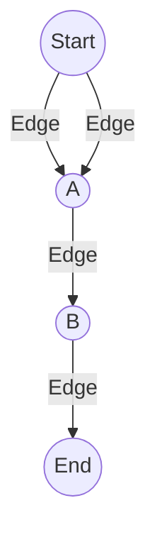
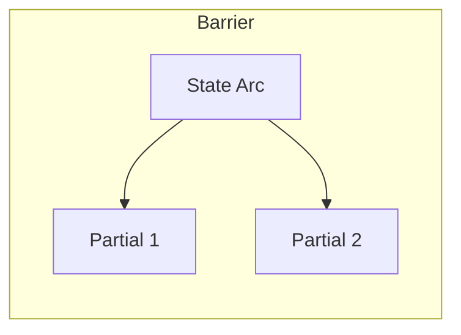
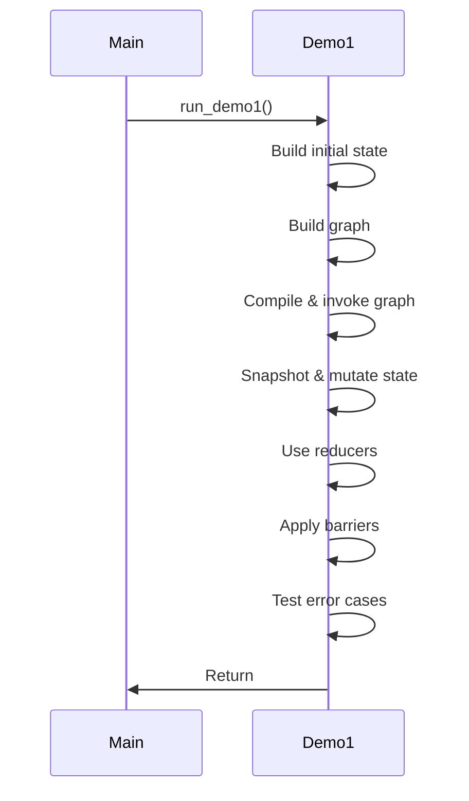

# Demo 1: Full Walkthrough of `run_demo1`

This document provides a comprehensive explanation of the logic and flow in `run_demo1.rs`, which is executed by `main()` in the Graft project. The demo showcases state initialization, graph construction, app invocation, state mutation, reducer usage, barrier scenarios, and error handling. Visual diagrams (Mermaid) are included for clarity.

---

## 1. Initial State Construction

The demo begins by creating a rich initial state using `VersionedState::new_with_user_message("Hello world")`. Additional fields are populated:

- `outputs.value`: Adds a seed output string.
- `meta.value`: Inserts a key-value pair.
- `extra.value`: Stores a JSON array of numbers.

```rust
let mut init = VersionedState::new_with_user_message("Hello world");
init.outputs.value.push("seed output".into());
init.meta.value.insert("init_key".into(), "init_val".into());
init.extra.value.insert("numbers".into(), json!([1, 2, 3]));
```

---

## 2. Graph Construction

A multi-step graph is built using `GraphBuilder`. Nodes and edges are added to define the flow:

- **Nodes:** Start, A, B, End
- **Edges:**
    - Start → A (twice)
    - A → B
    - B → End
- **Entry Point:** Start



---

## 3. App Invocation

The graph is compiled and invoked with the initial state. The result is an asynchronously computed `final_state`.

```rust
let final_state = app.invoke(init).await?;
```

---

## 4. State Snapshot & Mutation

- **Snapshot:** Captures the state before mutation.
- **Mutation:** Adds a message and increments the version.
- **Snapshot After:** Shows the effect of mutation.

```rust
let snap_before = final_state.snapshot();
let mut mutated = final_state.clone();
mutated.messages.value.push(Message { ... });
mutated.messages.version += 1;
let snap_after = mutated.snapshot();
```

---

## 5. Reducer Demonstration

Reducers are used to manipulate collections:

- **ADD_MESSAGES:** Adds a message to a vector.
- **APPEND_VEC:** Appends outputs.
- **MAP_MERGE:** Merges metadata.

```rust
ADD_MESSAGES.apply(&mut demo_messages, vec![...]);
APPEND_VEC.apply(&mut demo_outputs, vec![...]);
MAP_MERGE.apply(&mut demo_meta, HashMap::from([...]));
```

---

## 6. Manual Barrier Scenarios

### a) Mixed Updates

Multiple partial updates are applied to the state using a barrier. Each update can affect messages, outputs, or metadata.



### b) No-op Updates

A barrier is applied with empty updates, resulting in no changes.

### c) Saturating Version Test

The message version is set to `u64::MAX` and a barrier is applied, demonstrating that the version does not overflow.

---

## 7. GraphBuilder Error Demonstrations

Two error scenarios are tested:

- **No Entry Set:** Attempting to compile a graph without an entry node.
- **Unregistered Entry:** Setting an entry node that was not registered.

Both cases print expected error messages.

---

## 8. Demo Completion

The demo prints a completion message, signaling the end of execution.

---

## Summary Flow



---

## Key Takeaways

- The demo illustrates the full lifecycle of state and graph management in Graft.
- Mermaid diagrams clarify graph structure and execution flow.
- Error handling and mutation logic are demonstrated for robustness.

---

For further details, see the annotated code in `src/run_demo1.rs`.
