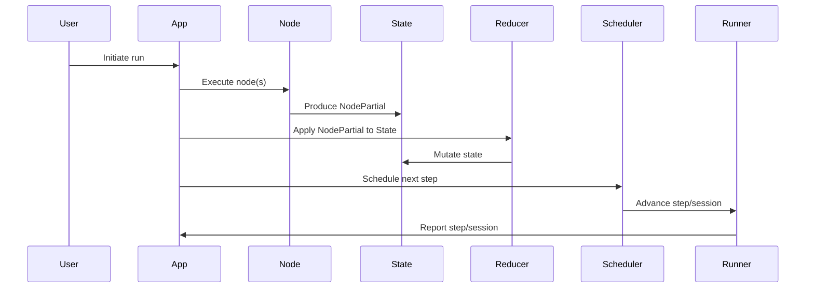

# Graft Codebase Architecture Guide

This guide provides a clear, structured overview of every module and file in the Graft codebase, describing their responsibilities and relationships. The flow moves from foundational utilities and types, through core data structures, up to orchestration and application logic.

---

## 1. Utilities (`utils`)

- **clock.rs**: Injectable clock abstraction for time sources (system and mock clocks).
- **deterministic_rng.rs**: Deterministic random number generator for reproducible runs.
- **id_generator.rs**: Unique ID generation utilities (UUID-based, with optional seeding).
- **json_ext.rs**: Helpers for deep merging and JSON pointer operations.
- **merge_inspector.rs**: Tools for inspecting/debugging state merges.
- **message_id_helpers.rs**: Ensures unique message/tool-call IDs per thread.
- **type_guards.rs**: Type-erasure guards for validating state/channel shapes.
- **mod.rs**: Re-exports all utility modules.

---

## 2. Types and Data Structures

- **types.rs**: Core enums for node kinds and channel types.
- **message.rs**: Defines the `Message` struct (role/content).
- **state.rs**: State management, including versioned state, snapshots, and channel abstractions.

---

## 3. Channels (`channels`)

- **mod.rs**: Defines the `Channel` trait and re-exports channel types.
- **messages.rs**: Implements the `MessagesChannel` for message passing.
- **extras.rs**: Implements the `ExtrasChannel` for arbitrary extension data.

---

## 4. Nodes and Graph

- **node.rs**: Defines the `Node` trait (async execution), node context, and example nodes.
- **graph.rs**: `GraphBuilder` for constructing node/edge graphs, entry points, and error handling.

---

## 5. Reducers (`reducers`)

- **mod.rs**: Unified reducer trait and re-exports.
- **add_messages.rs**: Appends new messages to state.
- **map_merge.rs**: Shallow merges extra data into state.
- **reducer_registery.rs**: Registry mapping channel types to reducers, with guards.
- **append_vec.rs**: (Disabled) Intended for vector appends.

---

## 6. Schedulers (`schedulers`)

- **mod.rs**: Re-exports scheduler types.
- **scheduler.rs**: Frontier scheduler with version gating and concurrency control.

---

## 7. Runtimes (`runtimes`)

- **mod.rs**: Re-exports runtime types.
- **runner.rs**: Orchestrates step execution, session state, and reporting.

---

## 8. Application Orchestration

- **app.rs**: Central orchestrator for graph execution, node/edge management, and reducer application.

---

## 9. Entry Points

- **lib.rs**: Main module, re-exports all submodules.
- **main.rs**: Application entry; currently just runs demo flows.

---

## Relationships

- **Utilities** support all modules with time, randomness, IDs, and type safety.
- **Types, state, and channels** form the backbone for message and data flow.
- **Nodes** implement computation; **graphs** organize nodes and edges.
- **Reducers** mutate state at barriers; **registry** maps channels to reducers.
- **Schedulers** control execution order and concurrency.
- **Runtimes** manage stepwise execution and session state.
- The **App** module ties everything together for orchestrated graph runs.

---

## Data Flow Example

