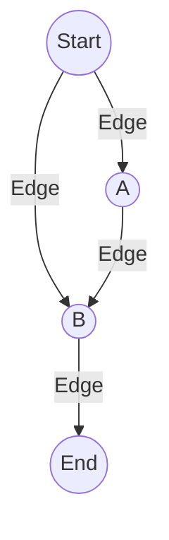
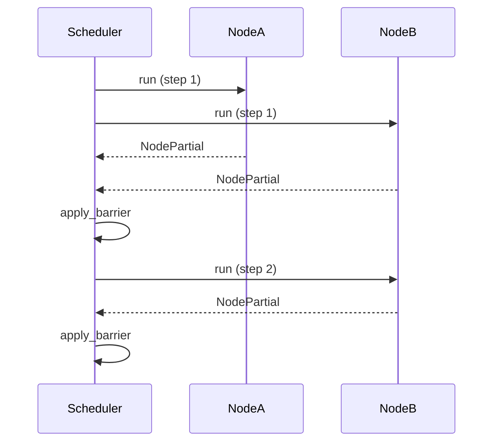

# Demo 2: Scheduler Runtime Walkthrough

This document explains the logic and flow of `run_demo2.rs`, demonstrating the new frontier-based scheduler, concurrency control, version gating, and verbose logging. The demo showcases multi-step graph execution, barrier application, and introspection of node activity. Mermaid diagrams and code snippets are included for clarity.

---

## 1. Initial State Construction

The demo starts by creating a `VersionedState` with a user message and extra seeded data:

```rust
let mut init = VersionedState::new_with_user_message("Hello Scheduler");
init.extra.get_mut().insert("numbers".into(), json!([4, 5, 6]));
init.extra.get_mut().insert("info".into(), json!({"stage": "init2"}));
```

---

## 2. Graph Construction

A richer graph is built to exercise concurrency and staged execution:

- **Nodes:** Start, A, B, End
- **Edges:**
    - Start → A
    - Start → B
    - A → B
    - B → End
- **Entry Point:** Start



This structure ensures that both A and B can run concurrently in the first superstep, and B is revisited in the second superstep due to A's output.

---

## 3. Scheduler Setup

A `Scheduler` is created with a configurable concurrency limit (e.g., 2):

```rust
let mut scheduler = Scheduler::new(2);
```

The initial frontier is set to the successors of Start:

```rust
let mut frontier: Vec<NodeKind> = app.edges().get(&NodeKind::Start).cloned().unwrap_or_default();
```

---

## 4. Superstep Execution & Logging

The demo enters a loop, executing supersteps until only End nodes remain. Each superstep includes:

- **Snapshot:** Consistent view of state for the step.
- **Frontier Analysis:** Prints current frontier and planned nodes to run (pre-gated by version).
- **Scheduler Run:** Executes nodes in the frontier with bounded concurrency, producing a `StepRunResult`.
- **Verbose Logging:**
    - Superstep header with message/extra counts and versions.
    - Ran/skipped nodes, with skip reasons (End vs version-gated).
    - Node outputs (message and extra counts).
    - Barrier updates and versions_seen for each ran node.
    - Next frontier computation.



---

## 5. Barrier Application

After each superstep, the barrier merges node outputs and applies reducers. The demo logs which channels were updated and the new versions for each node:

```rust
let updated_channels = app.apply_barrier(&state, &run_ids_pre, node_partials).await?...;
println!("Barrier updated channels: {:?}", updated_channels);
println!("versions_seen after run:");
for k in &run_ids_pre {
    // ... print per-node versions ...
}
```

---

## 6. Final State & Recap

When the frontier contains only End nodes, the demo prints the final state:

- All messages (with roles and content)
- Message and extra channel versions
- All extra keys and values

A recap summarizes how many times each node was run or skipped:

```rust
for k in keys {
    let r = ran_counts.get(&k).copied().unwrap_or(0);
    let s = skipped_counts.get(&k).copied().unwrap_or(0);
    println!("  - {:<12} | ran {:>2} | skipped {:>2}", k, r, s);
}
```

---

## Key Takeaways

- **Frontier-based scheduling** enables concurrent node execution and version-aware gating.
- **Scheduler** tracks versions_seen and enforces concurrency limits.
- **Verbose logging** provides deep insight into each superstep, node activity, and state evolution.
- **Barrier application** merges outputs and bumps channel versions as needed.
- **Recap** gives a clear summary of node participation.

---

For further details, see the annotated code in `src/run_demo2.rs`.
